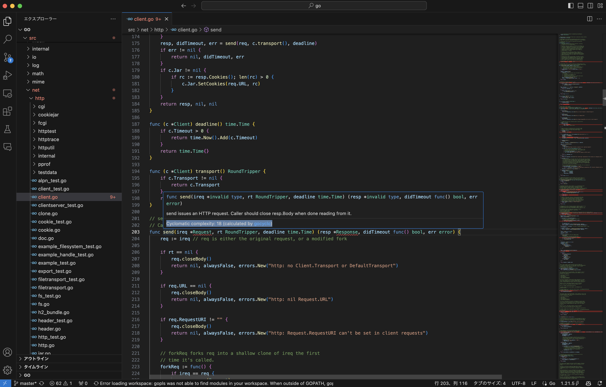

# vscode-gocyclo

vscode-gocyclo displays the cyclomatic complexities of functions in Go source code, utilizing [gocyclo](https://github.com/fzipp/gocyclo) for the calculations.
It automatically calculates the cyclomatic complexities of functions and displays the scores when you hover over a function. Whenever you modify and save a Go file, the complexities are recalculated to reflect the latest changes.

# Requirement

To use vscode-gocyclo, you must have [gocyclo](https://github.com/fzipp/gocyclo) installed on your system.

# Usage

Simply hover over a function within a Go source file. This extension displays the cyclomatic complexity, for example, `Cyclomatic complexity: 18 (calculated by gocyclo)`, as shown in the image below.

Using [icooon-mono.com](https://icooon-mono.com/10232-calculation/)
